# Simple Docker

1. [Готовый докер](#part-1-готовый-докер) \
2. [Операции с контейнером](#part-2-операции-с-контейнером) \
3. [Мини веб-сервер](#part-3-мини-веб-сервер) \
4. [Свой докер](#part-4-свой-докер) \
5. [Dockle](#part-5-dockle) \
6. [Базовый Docker Compose](#part-6-базовый-docker-compose)

## Part 1. Готовый докер

- Возьми официальный докер-образ с **nginx** и выкачай его при помощи `docker pull`.

- Проверь наличие докер-образа через `docker images`.

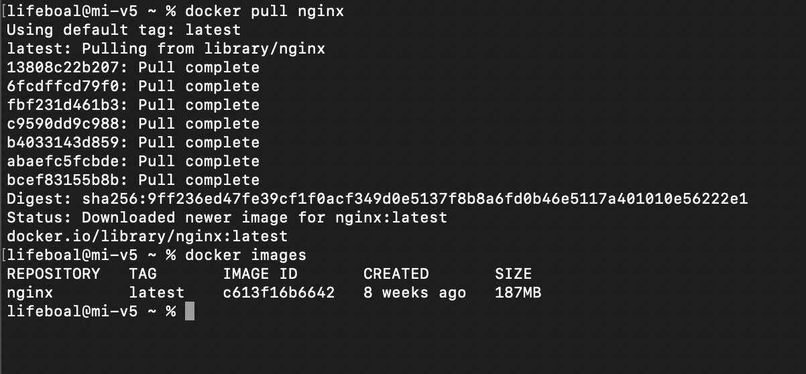

- Запусти докер-образ через `docker run -d [image_id|repository]`.

- Проверь, что образ запустился через `docker ps`.

- Посмотри информацию о контейнере через `docker inspect [container_id|container_name]`.

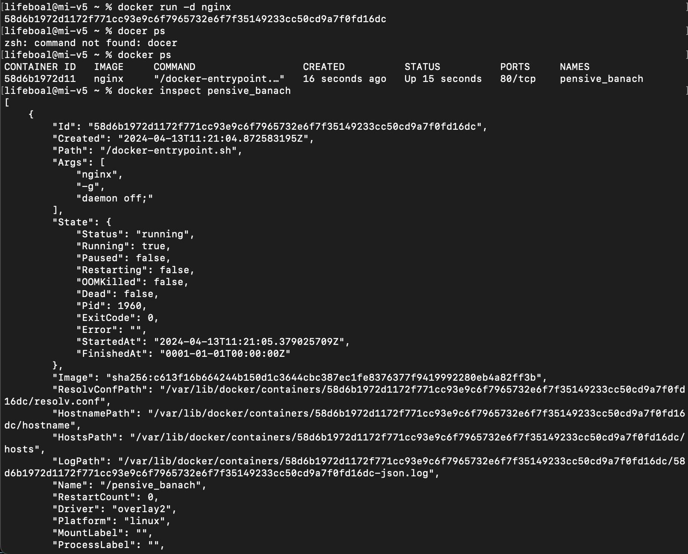

- По выводу команды определи и помести в отчёт размер контейнера, список замапленных портов и ip контейнера.

- Останови докер образ через `docker stop [container_id|container_name]`.

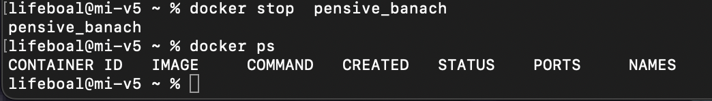

- Проверь, что образ остановился через `docker ps`.

- Запусти докер с портами 80 и 443 в контейнере, замапленными на такие же порты на локальной машине, через команду *run*.

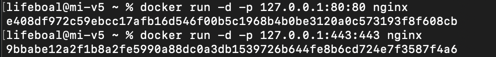

- Проверь, что в браузере по адресу *localhost:80* доступна стартовая страница **nginx**.

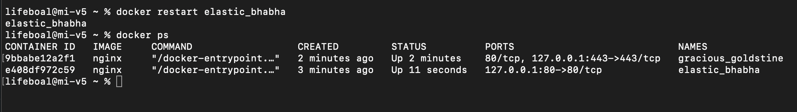

- Перезапусти докер контейнер через `docker restart [container_id|container_name]`.

- Проверь любым способом, что контейнер запустился.
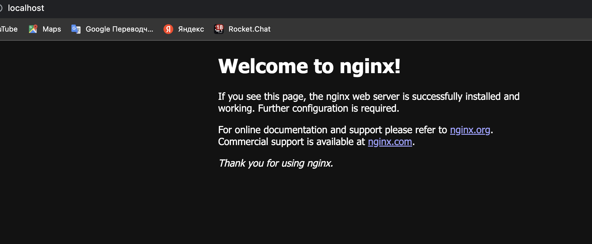

## Part 2. Операции с контейнером

- Прочитай конфигурационный файл *nginx.conf* внутри докер контейнера через команду *exec*.

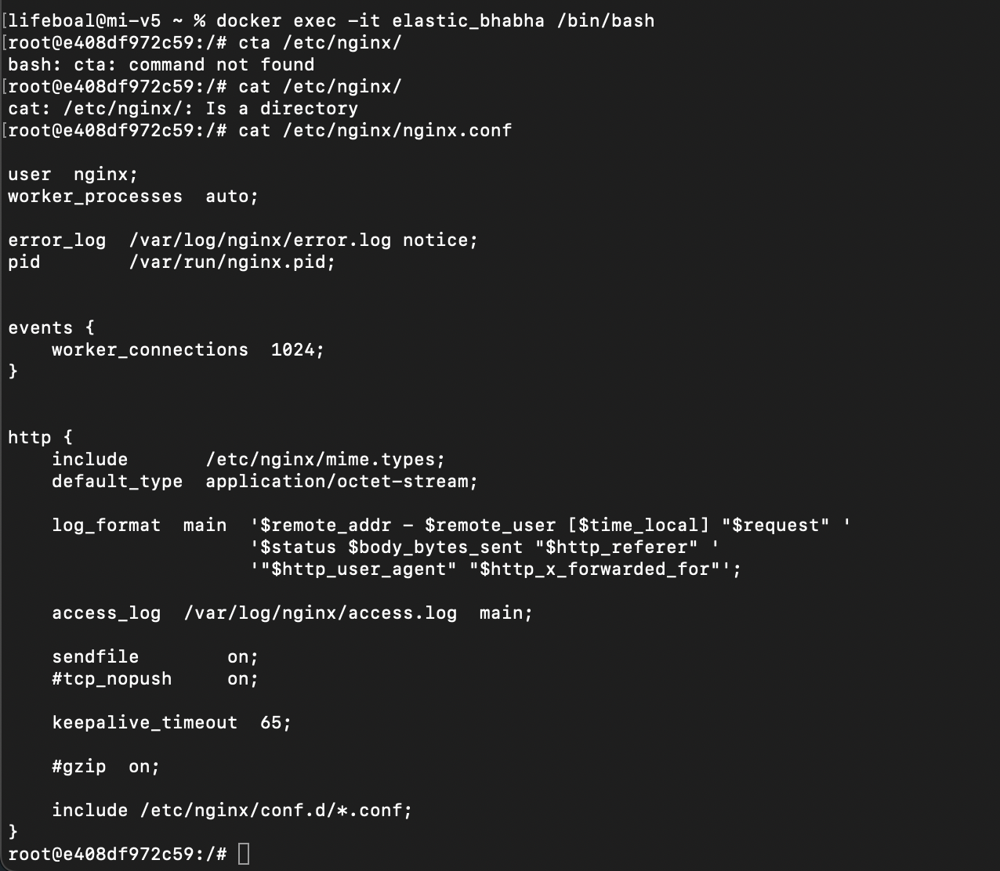

- Создай на локальной машине файл *nginx.conf*.

- Настрой в нем по пути */status* отдачу страницы статуса сервера **nginx**.
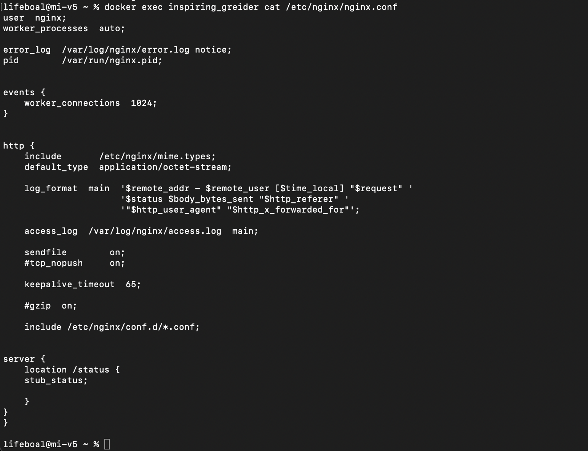

- Скопируй созданный файл *nginx.conf* внутрь докер-образа через команду `docker cp`.

- Перезапусти **nginx** внутри докер-образа через команду *exec*.

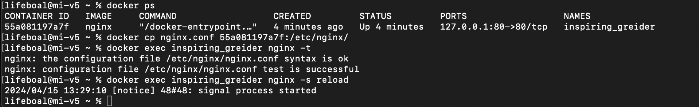

- Проверь, что по адресу *localhost:80/status* отдается страничка со статусом сервера **nginx**.

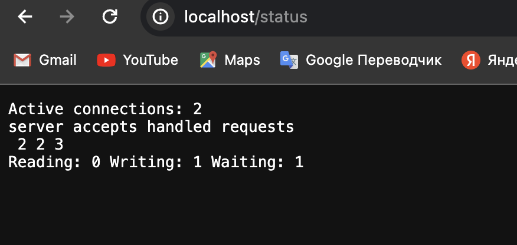

- Active connections – Количество всех открытых соединений. Это не количество пользователей, которые подключились к сайту, один пользователь для одного просмотра страницы может открыть множество одновременных соединений к серверу.

- Server accepts handled requests – Этот параметр показывает, три значения:
- Первый — это количество всех принятых соединений.
- Второй — это количество всех прерванных соединений. Обычно первые 2 значения одинаковы.
- Третий — это количество обрабатывающихся запросов (как правило, данный параметр больше чем второе значение).
- Reading – Количество считанных заголовков запроса в nginx.
- Writing – Nginx читает тело запроса, обрабатывает запрос, или пишет ответ на клиента.
- Waiting – Keep-Alive соединения, на самом деле активно – (чтение + запись). Эта величина зависит от keepalive-timeout. Это значение можно проигнорировать.

- Экспортируй контейнер в файл *container.tar* через команду *export*.
    -  -o, --output string   Write to a file, instead of STDOUT

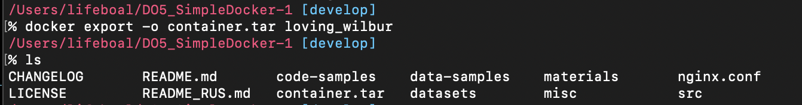

- Останови контейнер.

- Удали образ через `docker rmi [image_id|repository]`, не удаляя перед этим контейнеры.

    - -f, --force      Force removal of the image

- Удали остановленный контейнер.

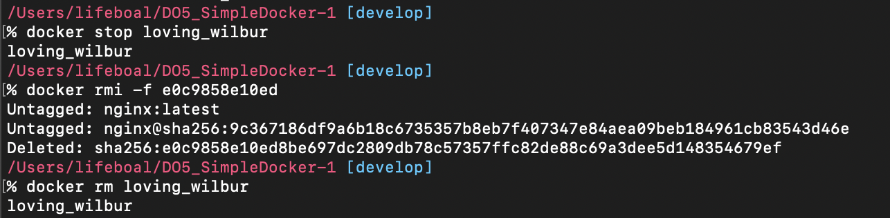

- Импортируй контейнер обратно через команду *import*.

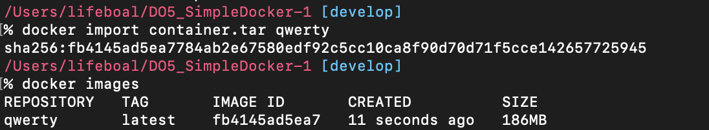

- Запусти импортированный контейнер.

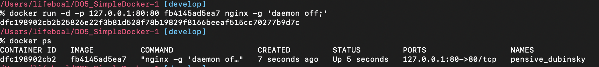

- Проверь, что по адресу *localhost:80/status* отдается страничка со статусом сервера **nginx**.

## Part 3. Мини веб-сервер

- Напиши мини-сервер на **C** и **FastCgi**, который будет возвращать простейшую страничку с надписью `Hello World!`.

- Напиши свой *nginx.conf*, который будет проксировать все запросы с 81 порта на *127.0.0.1:8080*.

- Запуск контейнера с замапленным портом 81 и установка на него необходимых библиотек ibfcgi, spawn-fcgi, gcc

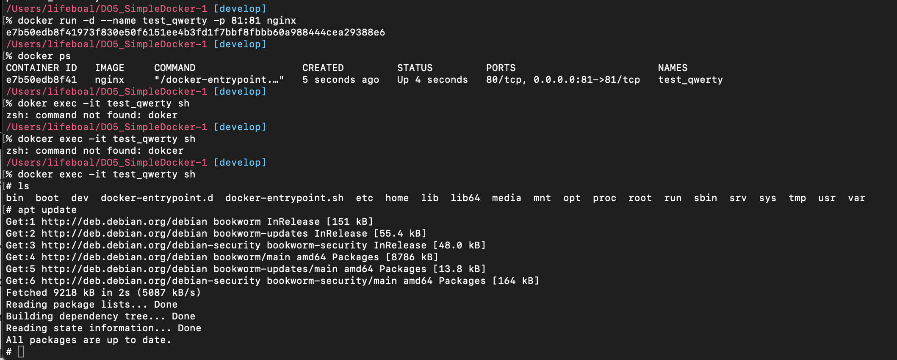

- скопировал мини-сервер и nginx конфиг в докер

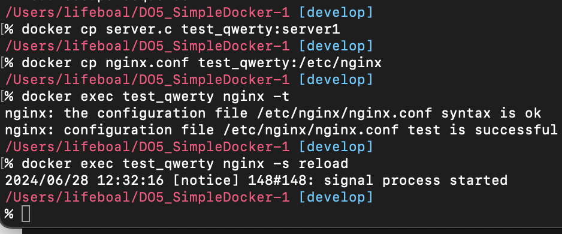

- скомпилировал fastCgi

- Запусти написанный мини-сервер через *spawn-fcgi* на порту 8080.

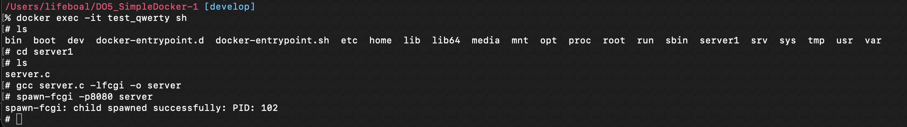

- Проверь, что в браузере по *localhost:81* отдается написанная тобой страничка.

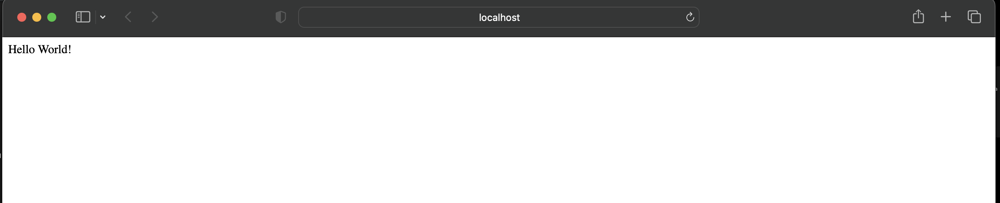

## Part 4. Свой докер

- Напиши свой докер-образ, который:
	- собирает исходники мини сервера на FastCgi из [Части 3](#part-3-мини-веб-сервер);
	- запускает его на 8080 порту;
	- копирует внутрь образа написанный *./nginx/nginx.conf*;
	- запускает **nginx**.

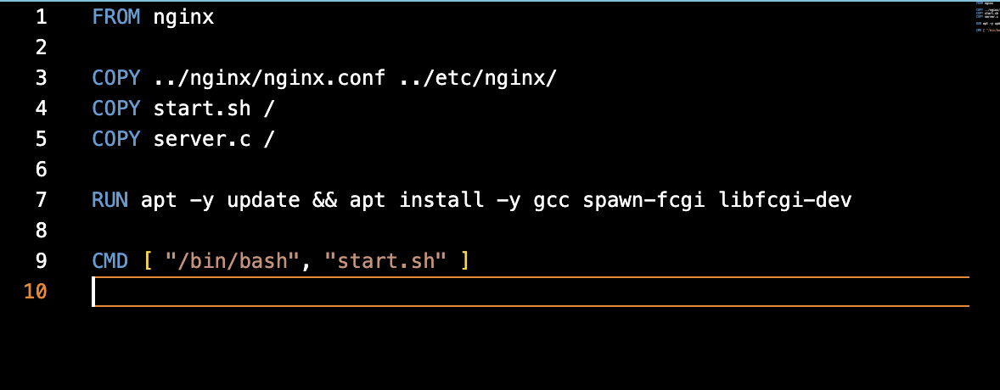

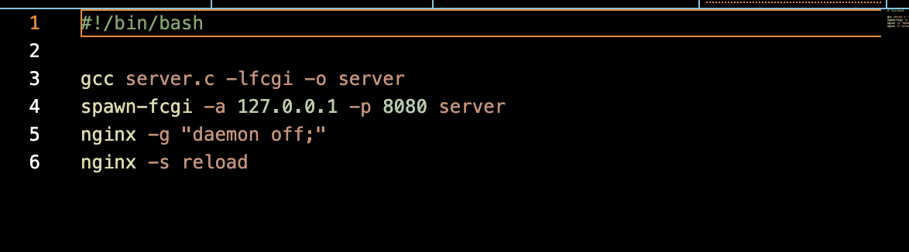

- Cобери написанный докер-образ через `docker build` при этом указав имя и тег.

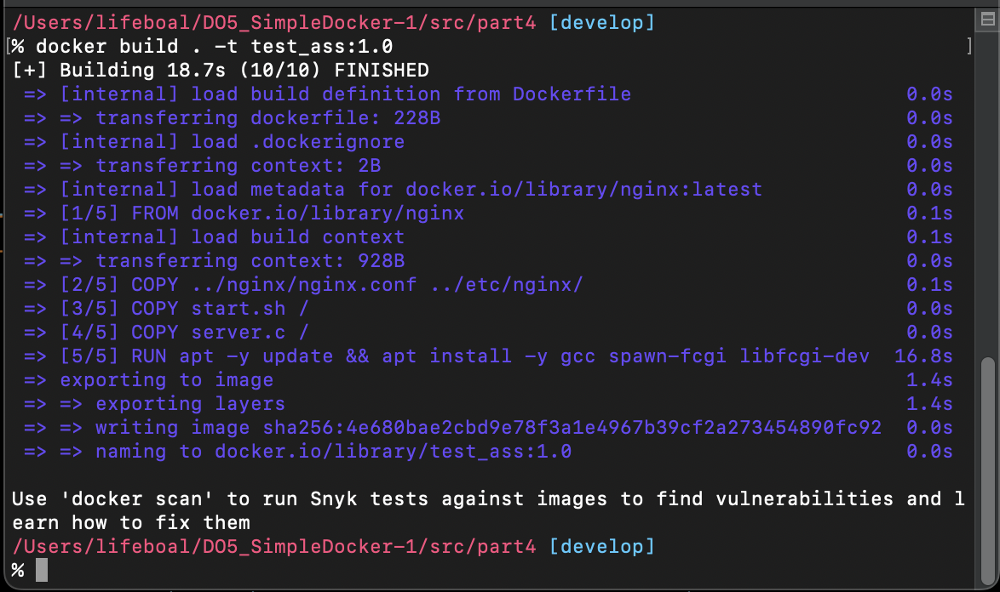

- Проверь через `docker images`, что все собралось корректно.

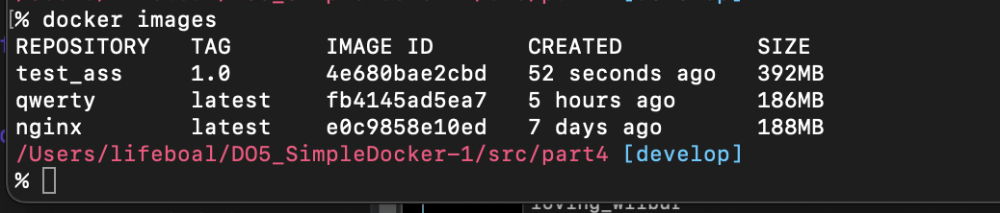

- Добавил в nginx.conf к сервер listen  [::]:81;

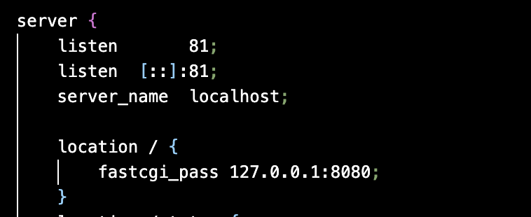

- Запусти собранный докер-образ с маппингом 81 порта на 80 на локальной машине и маппингом папки *./nginx* внутрь контейнера по адресу, где лежат конфигурационные файлы **nginx**'а (см. [Часть 2](#part-2-операции-с-контейнером)).

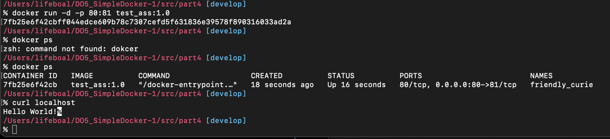

- Проверь, что по localhost:80 доступна страничка написанного мини сервера.

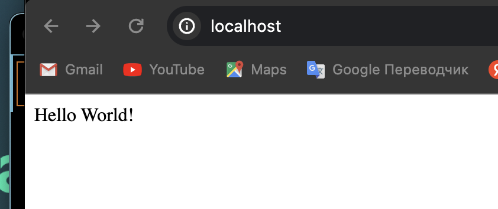

- Допиши в *./nginx/nginx.conf* проксирование странички */status*, по которой надо отдавать статус сервера **nginx**.

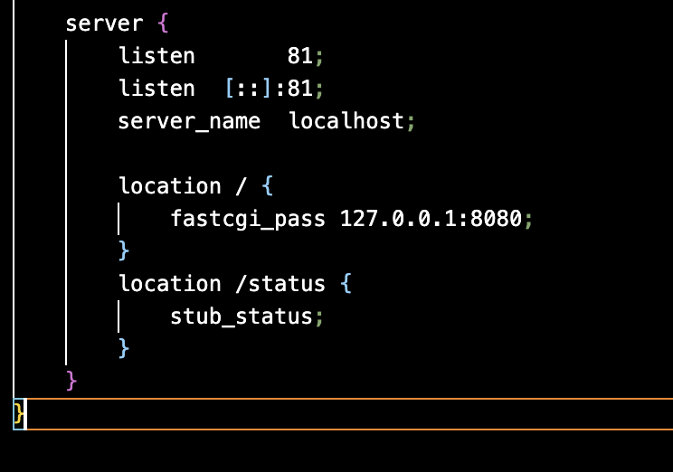

- Перезапусти докер-образ.

- Проверь, что теперь по *localhost:80/status* отдается страничка со статусом **nginx**

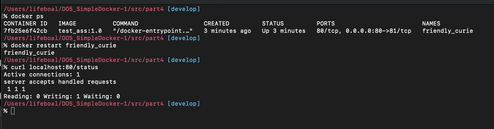

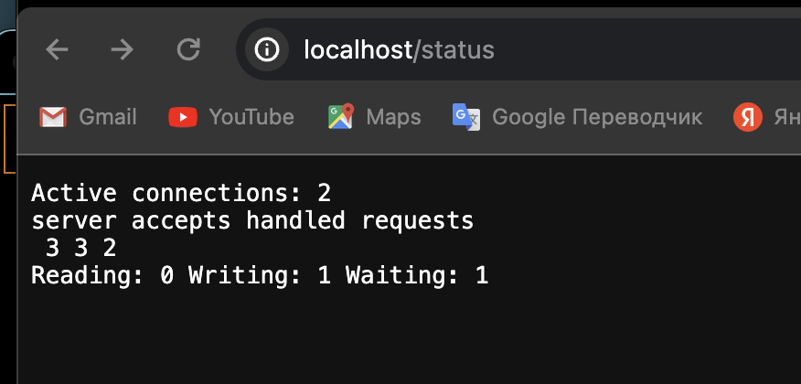

## Part 5. **Dockle**

- Просканируй образ из предыдущего задания через `dockle [image_id|repository]`.

	- brew install goodwithtech/r/dockle

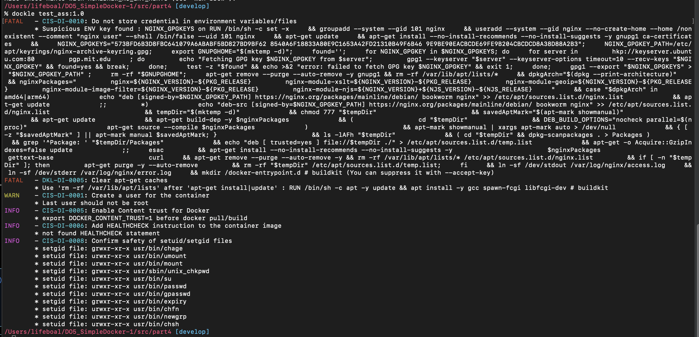

- Исправь образ так, чтобы при проверке через **dockle** не было ошибок и предупреждений.

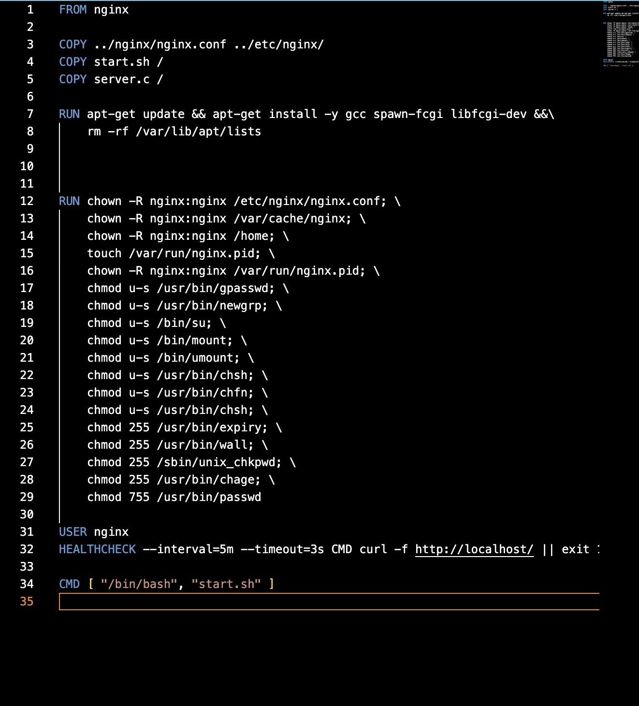

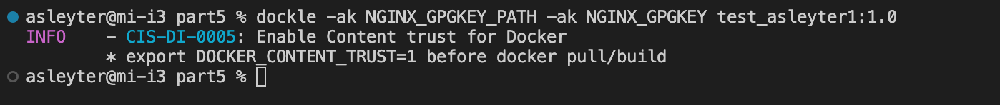

## Part 6. Базовый **Docker Compose**

- Напиши файл *docker-compose.yml*, с помощью которого:
	- Подними докер-контейнер из [Части 5](#part-5-инструмент-dockle) _(он должен работать в локальной сети, т.е. не нужно использовать инструкцию **EXPOSE** и мапить порты на локальную машину)_.
	- Подними докер-контейнер с **nginx**, который будет проксировать все запросы с 8080 порта на 81 порт первого контейнера.
	- Замапь 8080 порт второго контейнера на 80 порт локальной машины.

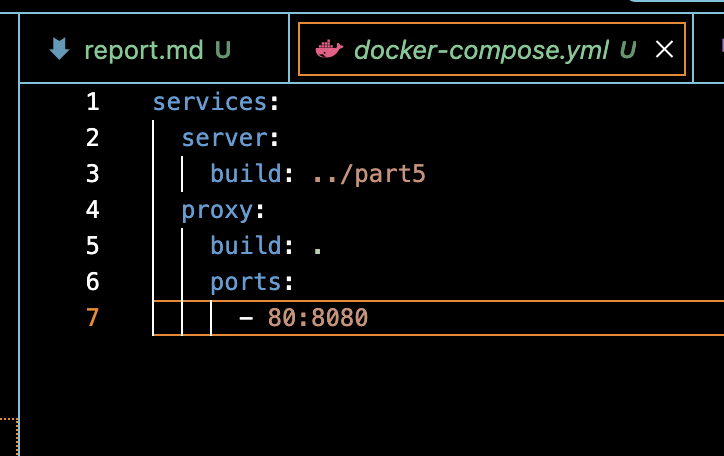

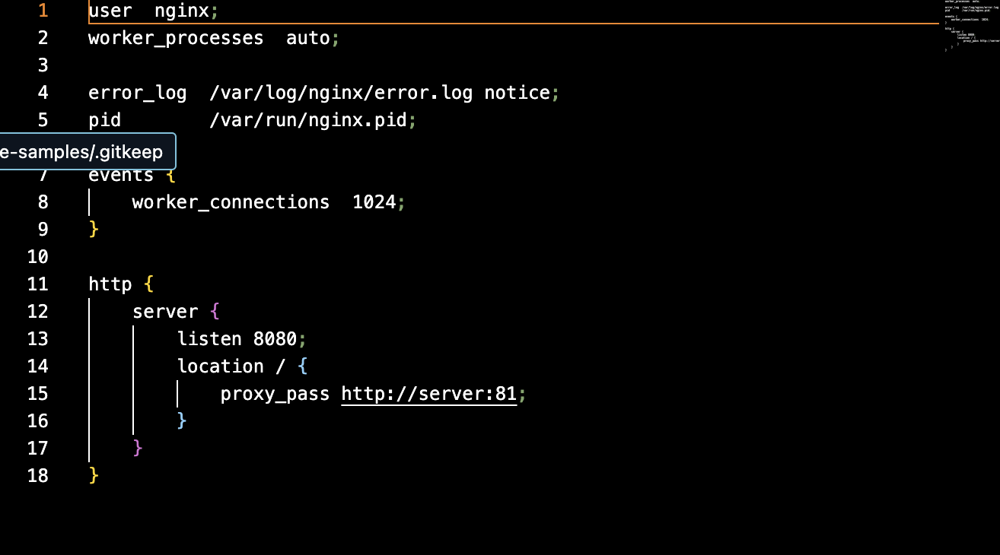

- Останови все запущенные контейнеры.

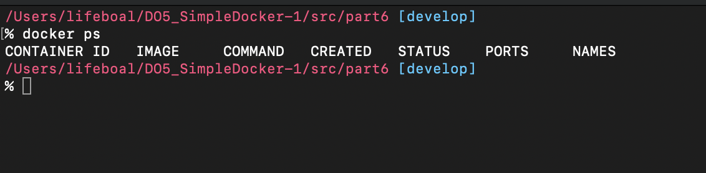

- !! Для корректной работы compose up переделал Part 5.

- Собери и запусти проект с помощью команд `docker-compose build` и `docker-compose up`.

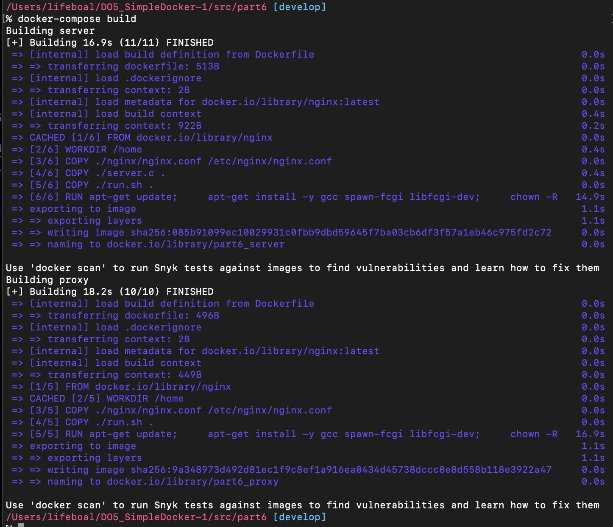
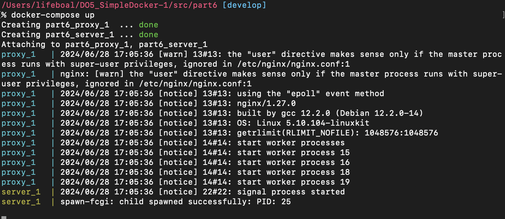

- Проверь, что в браузере по *localhost:80* отдается написанная тобой страничка, как и ранее.
